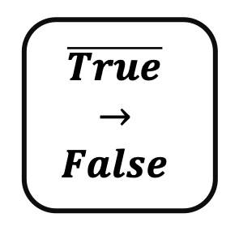

<!--
  ~ Licensed to the Apache Software Foundation (ASF) under one or more
  ~ contributor license agreements.  See the NOTICE file distributed with
  ~ this work for additional information regarding copyright ownership.
  ~ The ASF licenses this file to You under the Apache License, Version 2.0
  ~ (the "License"); you may not use this file except in compliance with
  ~ the License.  You may obtain a copy of the License at
  ~
  ~    http://www.apache.org/licenses/LICENSE-2.0
  ~
  ~ Unless required by applicable law or agreed to in writing, software
  ~ distributed under the License is distributed on an "AS IS" BASIS,
  ~ WITHOUT WARRANTIES OR CONDITIONS OF ANY KIND, either express or implied.
  ~ See the License for the specific language governing permissions and
  ~ limitations under the License.
  ~
  -->

## Boolescher Inverter

<p align="center">
    
</p>

***

## Beschreibung

Der Boolesche Inverter-Prozessor invertiert den Wert eines booleschen Feldes in einem Datenstrom. Er unterstützt:
* Einzelfeld-Invertierung
* TRUE zu FALSE Konvertierung
* FALSE zu TRUE Konvertierung
* Direkte Wertmodifikation
* Einfache boolesche Logik
* Direkte Wertnegation

Dieser Prozessor ist essentiell für:
* Negieren boolescher Bedingungen
* Invertieren von Steuersignalen
* Komplementieren von Zustandswerten
* Umkehren von Logikgattern
* Erstellen entgegengesetzter Zustände
* Implementieren von NOT-Operationen

***

## Erforderliche Eingabe

Der Prozessor benötigt einen Datenstrom, der mindestens ein boolesches Feld zur Invertierung enthält.

***

## Konfiguration

### Invertierendes Feld

Wähle das zu invertierende boolesche Feld aus. Der Wert dieses Feldes wird negiert (TRUE wird zu FALSE, FALSE wird zu TRUE).

## Ausgabe

Der Prozessor erstellt ein neues Ereignis, das enthält:
* Alle ursprünglichen Felder aus dem Eingabe-Ereignis
* Das ausgewählte Feld mit invertiertem Wert

### Beispiel

#### Eingabe-Ereignis
```json
{
  "deviceId": "sensor01",
  "isActive": true,
  "timestamp": 1586380104915
}
```

#### Konfiguration
* Invertierendes Feld: isActive

#### Ausgabe-Ereignis
```json
{
  "deviceId": "sensor01",
  "isActive": false,
  "timestamp": 1586380104915
}
```

## Anwendungsfälle

1. **Steuerungssysteme**
   * Invertieren von Steuersignalen
   * Negieren von Statusflags
   * Umkehren von Logikgattern
   * Komplementieren von Zuständen
   * Erstellen entgegengesetzter Bedingungen

2. **Zustandsverwaltung**
   * Invertieren von Zustandswerten
   * Negieren von Statusindikatoren
   * Umkehren von booleschen Flags
   * Komplementieren von Bedingungen
   * Erstellen inverser Zustände

3. **Logikoperationen**
   * Implementieren von NOT-Gattern
   * Negieren von Bedingungen
   * Umkehren boolescher Logik
   * Komplementieren von Ausdrücken
   * Erstellen entgegengesetzter Zustände

4. **Signalverarbeitung**
   * Invertieren digitaler Signale
   * Negieren binärer Werte
   * Umkehren boolescher Zustände
   * Komplementieren von Bedingungen
   * Erstellen inverser Signale

## Hinweise

* Nur boolesche Felder können invertiert werden
* Invertierung erfolgt direkt
* Ursprünglicher Wert wird ersetzt
* Verarbeitung ist zustandslos
* Mehrere Invertierungen erfordern Verkettung
* Logikimplikationen beachten
* Invertierung erfolgt sofort
* Keine Verzögerung bei der Verarbeitung
* Keine zusätzlichen Felder werden erstellt
* Einfache boolesche Negation 