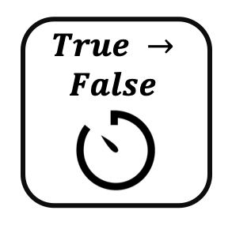

<!--
  ~ Licensed to the Apache Software Foundation (ASF) under one or more
  ~ contributor license agreements.  See the NOTICE file distributed with
  ~ this work for additional information regarding copyright ownership.
  ~ The ASF licenses this file to You under the Apache License, Version 2.0
  ~ (the "License"); you may not use this file except in compliance with
  ~ the License.  You may obtain a copy of the License at
  ~
  ~    http://www.apache.org/licenses/LICENSE-2.0
  ~
  ~ Unless required by applicable law or agreed to in writing, software
  ~ distributed under the License is distributed on an "AS IS" BASIS,
  ~ WITHOUT WARRANTIES OR CONDITIONS OF ANY KIND, either express or implied.
  ~ See the License for the specific language governing permissions and
  ~ limitations under the License.
  ~
  -->

## Boolescher Timer

<p align="center">
    
</p>

***

## Beschreibung

Der Boolesche Timer-Prozessor misst die Dauer, die ein boolesches Feld einen bestimmten Zustand beibehält. Er unterstützt:
* Messung der TRUE-Zustandsdauer
* Messung der FALSE-Zustandsdauer
* Mehrere Zeiteinheiten (Millisekunden, Sekunden, Minuten)
* Zustandsänderungserkennung
* Dauerverfolgung

Dieser Prozessor ist essentiell für:
* Messung von Zustandsdauern
* Überwachung von Aktivitäts-/Inaktivitätszeiten
* Verfolgung von Betriebsperioden
* Berechnung von Zykluszeiten

***

## Erforderliche Eingabe

Der Prozessor benötigt einen Datenstrom, der mindestens ein boolesches Feld zur Messung seiner Zustandsdauer enthält.

***

## Konfiguration

### Boolesches Feld

Wähle das boolesche Feld aus, dessen Zustandsdauer überwacht werden soll. Dieses Feld wird verwendet, um zu messen, wie lange es einen bestimmten Zustand beibehält.

### Zu beobachtender Wert

Wähle aus, für welchen Zustand die Dauer gemessen werden soll:

* **TRUE**: Messen, wie lange das Feld true bleibt
  * Verwendung für: Messung von Aktivitätsperioden
  * Beispiel: Maschinenlaufzeit

* **FALSE**: Messen, wie lange das Feld false bleibt
  * Verwendung für: Messung von Inaktivitätsperioden
  * Beispiel: Ausfallzeit

### Ausgabeeinheit

Wähle die Zeiteinheit für die gemessene Dauer:

* **Millisekunden**: Rohwerte in Millisekunden
  * Verwendung für: Präzise Zeitmessung
  * Beispiel: Antwortzeitmessung

* **Sekunden**: Dauer in Sekunden (Millisekunden / 1000)
  * Verwendung für: Allgemeine Zeitmessung
  * Beispiel: Prozessdauer

* **Minuten**: Dauer in Minuten (Millisekunden / 60000)
  * Verwendung für: Lange Zeiträume
  * Beispiel: Betriebszeit

## Ausgabe

Der Prozessor erstellt ein neues Ereignis, das enthält:
* Alle ursprünglichen Felder aus dem Eingabe-Ereignis
* Ein neues Feld namens "measured_time" mit der Dauer in der ausgewählten Einheit

### Beispiel

#### Eingabe-Ereignisstrom
```json
[
  {
    "deviceId": "machine01",
    "isRunning": false,
    "timestamp": 1586380104915
  },
  {
    "deviceId": "machine01",
    "isRunning": true,
    "timestamp": 1586380105915
  },
  {
    "deviceId": "machine01",
    "isRunning": true,
    "timestamp": 1586380106915
  },
  {
    "deviceId": "machine01",
    "isRunning": false,
    "timestamp": 1586380107915
  }
]
```

#### Konfiguration 1: TRUE-Zustand in Sekunden
* Boolesches Feld: isRunning
* Zu beobachtender Wert: TRUE
* Ausgabeeinheit: Sekunden

#### Ausgabe-Ereignis
```json
{
  "deviceId": "machine01",
  "isRunning": false,
  "timestamp": 1586380107915,
  "measured_time": 2.0
}
```

## Anwendungsfälle

1. **Geräteüberwachung**
   * Messung der Maschinenlaufzeit
   * Verfolgung von Ausfallzeiten
   * Überwachung von Aktivitätszuständen
   * Berechnung von Zykluszeiten

2. **Prozesssteuerung**
   * Messung der Prozessdauer
   * Verfolgung von Zustandsänderungen
   * Überwachung von Betriebszeiten
   * Berechnung von Antwortzeiten

## Hinweise

* Nur boolesche Felder können gemessen werden
* Verarbeitung ist zustandsbehaftet
* Zeitmessung basiert auf Systemzeit
* Messung beginnt, wenn der ausgewählte Zustand erkannt wird
* Messung endet, wenn der entgegengesetzte Zustand erkannt wird
* Ausgabe wird nur generiert, wenn die Messung endet
* Zeiteinheiten werden automatisch umgerechnet
* Ursprüngliche Ereignisfelder werden beibehalten 