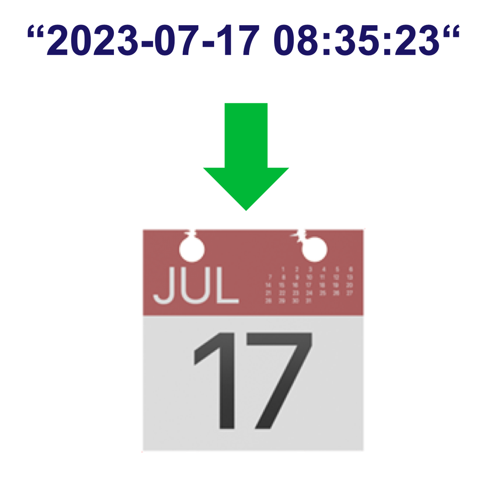

<!--
  ~ Licensed to the Apache Software Foundation (ASF) under one or more
  ~ contributor license agreements.  See the NOTICE file distributed with
  ~ this work for additional information regarding copyright ownership.
  ~ The ASF licenses this file to You under the Apache License, Version 2.0
  ~ (the "License"); you may not use this file except in compliance with
  ~ the License.  You may obtain a copy of the License at
  ~
  ~    http://www.apache.org/licenses/LICENSE-2.0
  ~
  ~ Unless required by applicable law or agreed to in writing, software
  ~ distributed under the License is distributed on an "AS IS" BASIS,
  ~ WITHOUT WARRANTIES OR CONDITIONS OF ANY KIND, either express or implied.
  ~ See the License for the specific language governing permissions and
  ~ limitations under the License.
  ~
  -->

## Datumszeit aus String

<p align="center">
    
</p>

***

## Beschreibung

Der Datumszeit aus String Prozessor konvertiert String-Zeitstempel in Millisekunden-Zeitstempel. Er unterstützt:
* ISO 8601 Format-Parsing
* Zeitzonen-Handling
* String-zu-Millisekunden-Konvertierung
* Automatische Zeitzonen-Anwendung

Dieser Prozessor ist essentiell für:
* Konvertierung von Zeitstempeln in Millisekunden
* Standardisierung von Datumsformaten
* Handhabung von Zeitzonen-Konvertierungen
* Verarbeitung von ISO 8601 Datumsangaben

***

## Erforderliche Eingabe

Der Prozessor benötigt einen Datenstrom, der mindestens ein String-Feld mit einem Zeitstempel im ISO 8601 Format enthält.

***

## Konfiguration

### Datumszeit-String

Wählen Sie das Feld aus, das den Zeitstempel-String enthält. Der String sollte im ISO 8601 Format sein (z.B. '2023-11-29T18:30:22' oder '2023-11-29T18:30:22+01:00').

### Zeitzone

Wählen Sie die Zeitzone für den Eingabe-Zeitstempel. Diese wird verwendet, wenn der Zeitstempel-String keine Zeitzoneninformationen enthält. Wenn der Eingabe-String bereits Zeitzoneninformationen enthält, wird diese Einstellung ignoriert.

## Ausgabe

Der Prozessor erstellt ein neues Ereignis, das enthält:
* Alle ursprünglichen Felder aus dem Eingabe-Ereignis
* Ein neues Feld namens "timestringInMillis" mit dem Zeitstempel in Millisekunden seit der Epoche
* Ein neues Feld namens "timeZone" mit der ausgewählten Zeitzone

### Beispiel

#### Eingabe-Ereignis
```json
{
  "deviceId": "sensor01",
  "timestamp": "2023-11-29T18:30:22",
  "value": 23.5
}
```

#### Konfiguration
* Datumszeit-String: timestamp
* Zeitzone: UTC

#### Ausgabe-Ereignis
```json
{
  "deviceId": "sensor01",
  "timestamp": "2023-11-29T18:30:22",
  "value": 23.5,
  "timestringInMillis": 1701279022000,
  "timeZone": "UTC"
}
```

## Anwendungsfälle

1. **Datenstandardisierung**
   * Konvertierung von Zeitstempeln in Millisekunden
   * Standardisierung von Datumsformaten
   * Handhabung von Zeitzonen-Konvertierungen
   * Verarbeitung von ISO 8601 Datumsangaben

2. **Systemintegration**
   * Abbildung von Zeitstempeln auf Millisekunden
   * Konvertierung zwischen Zeitzonen
   * Standardisierung von Datumsformaten
   * Verarbeitung zeitbasierter Daten

## Hinweise

* Eingabe muss im ISO 8601 Format sein
* Zeitzone im Eingabe-String hat Vorrang vor der ausgewählten Zeitzone
* Ungültige Formate führen zu Verarbeitungsfehlern
* Verarbeitung ist zustandslos
* Ausgabe ist immer in Millisekunden seit der Epoche 