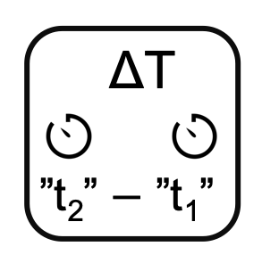

<!--
  ~ Licensed to the Apache Software Foundation (ASF) under one or more
  ~ contributor license agreements.  See the NOTICE file distributed with
  ~ this work for additional information regarding copyright ownership.
  ~ The ASF licenses this file to You under the Apache License, Version 2.0
  ~ (the "License"); you may not use this file except in compliance with
  ~ the License.  You may obtain a copy of the License at
  ~
  ~    http://www.apache.org/licenses/LICENSE-2.0
  ~
  ~ Unless required by applicable law or agreed to in writing, software
  ~ distributed under the License is distributed on an "AS IS" BASIS,
  ~ WITHOUT WARRANTIES OR CONDITIONS OF ANY KIND, either express or implied.
  ~ See the License for the specific language governing permissions and
  ~ limitations under the License.
  ~
  -->

## Dauer berechnen

<p align="center">
    
</p>

***

## Beschreibung

Der Dauer-berechnen-Prozessor berechnet die Zeitdifferenz zwischen zwei Zeitstempeln. Er unterstützt:
* Zeitdifferenzberechnung
* Mehrere Zeiteinheiten
* Start-/End-Zeitstempelauswahl
* Dauerermittlung

Dieser Prozessor ist essentiell für:
* Messung von Zeiträumen
* Berechnung von Dauern
* Analyse von Intervallen
* Verfolgung von Zeitspannen

***

## Erforderliche Eingabe

Der Prozessor benötigt einen Datenstrom, der mindestens zwei Zeitstempelfelder zur Berechnung der Dauer zwischen ihnen enthält.

***

## Konfiguration

### Start-Zeitstempel

Wähle das Feld mit dem Start-Zeitstempel aus. Dieser Zeitstempel markiert den Beginn des Zeitraums.

### End-Zeitstempel

Wähle das Feld mit dem End-Zeitstempel aus. Dieser Zeitstempel markiert das Ende des Zeitraums.

### Zeiteinheit

Wähle die Einheit für die berechnete Dauer:
* Millisekunden (Standard)
* Sekunden
* Minuten

## Ausgabe

Der Prozessor erstellt eine neue Nachricht, die enthält:
* Alle ursprünglichen Felder aus der Eingabe-Nachricht
* Ein neues Feld namens "duration" mit der berechneten Zeitdifferenz in der ausgewählten Einheit

### Beispiel

#### Eingabe-Nachricht
```json
{
  "deviceId": "machine01",
  "startTime": 1586380104915,
  "endTime": 1586380105915,
  "operation": "process1"
}
```

#### Konfiguration
* Start-Zeitstempel: startTime
* End-Zeitstempel: endTime
* Zeiteinheit: Sekunden

#### Ausgabe-Nachricht
```json
{
  "deviceId": "machine01",
  "startTime": 1586380104915,
  "endTime": 1586380105915,
  "operation": "process1",
  "duration": 1.0
}
```

## Anwendungsfälle

1. **Prozessüberwachung**
   * Messung der Prozessdauer
   * Verfolgung von Operationszeiten
   * Überwachung von Zykluszeiten
   * Berechnung von Zeiträumen

2. **Leistungsanalyse**
   * Messung von Antwortzeiten
   * Verfolgung von Ausführungszeiten
   * Überwachung von Dauern
   * Berechnung von Intervallen

## Hinweise

* Beide Zeitstempel müssen vorhanden sein
* Zeitstempel müssen gültig sein
* Endzeit muss nach Startzeit liegen
* Verarbeitung ist zustandslos
* Mehrere Dauern erfordern Verkettung
* Negative Dauern werden nicht unterstützt 