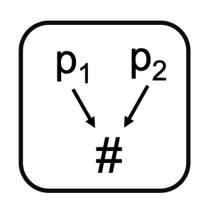

<!--
  ~ Licensed to the Apache Software Foundation (ASF) under one or more
  ~ contributor license agreements.  See the NOTICE file distributed with
  ~ this work for additional information regarding copyright ownership.
  ~ The ASF licenses this file to You under the Apache License, Version 2.0
  ~ (the "License"); you may not use this file except in compliance with
  ~ the License.  You may obtain a copy of the License at
  ~
  ~    http://www.apache.org/licenses/LICENSE-2.0
  ~
  ~ Unless required by applicable law or agreed to in writing, software
  ~ distributed under the License is distributed on an "AS IS" BASIS,
  ~ WITHOUT WARRANTIES OR CONDITIONS OF ANY KIND, either express or implied.
  ~ See the License for the specific language governing permissions and
  ~ limitations under the License.
  ~
  -->

## Feld-Mapper

<p align="center">
    
</p>

***

## Beschreibung

Der Feld-Mapper-Prozessor kombiniert mehrere Felder zu einem einzelnen Feld, indem er einen MD5-Hash-Wert ihrer kombinierten Inhalte berechnet. Dieser Prozessor ist besonders nützlich für:

* Erstellung eindeutiger Identifikatoren aus mehreren Feldern
* Datenanonymisierung und Datenschutz
* Reduzierung der Datenkomplexität
* Generierung konsistenter Schlüssel für Daten-Gruppierung
* Kombinierung verwandter Felder zu einer einzelnen Referenz

***

## Erforderliche Eingabe

Der Prozessor kann mit jedem Ereignis arbeiten, das mindestens ein Feld enthält. Die zu mappenden Felder können von jedem Datentyp sein, da sie vor dem Hashing in ihre String-Darstellung umgewandelt werden.

***

## Konfiguration

### Felder

Wähle ein oder mehrere Felder aus, die zu einem einzelnen Hash-Wert kombiniert werden sollen. Die Reihenfolge der Feldauswahl ist wichtig, da sie den resultierenden Hash-Wert beeinflusst.

### Neuer Feldname

Gib den Namen des neuen Feldes an, das den MD5-Hash-Wert der kombinierten Felder enthalten wird.

## Ausgabe

Der Prozessor erstellt ein neues Ereignis, das:
* Alle Felder aus dem Eingabe-Ereignis beibehält, die nicht für das Mapping ausgewählt wurden
* Ein neues Feld mit dem angegebenen Namen hinzufügt, das den MD5-Hash der kombinierten ausgewählten Felder enthält
* Die ursprünglichen Felder entfernt, die gemappt wurden

### Beispiel

#### Eingabe-Ereignis
```json
{
  "timestamp": 1586380104915,
  "mass_flow": 4.3167,
  "temperature": 40.05,
  "pressure": 1013.25,
  "sensorId": "flowrate01"
}
```

#### Konfiguration
* Felder: mass_flow, temperature
* Neuer Feldname: combined_measurement

#### Ausgabe-Ereignis
```json
{
  "timestamp": 1586380104915,
  "pressure": 1013.25,
  "sensorId": "flowrate01",
  "combined_measurement": "8ae11f5c83610104408d485b73120832"
}
```

## Anwendungsfälle

1. **Datenschutz**
   * Kombinieren personenbezogener Daten (PII) zu anonymisierten Identifikatoren
   * Erstellung datenschutzfreundlicher Schlüssel für Datenverknüpfung
   * Generierung von Pseudonymen für sensible Daten

2. **Datenintegration**
   * Erstellung zusammengesetzter Schlüssel für Datenverknüpfung
   * Generierung eindeutiger Identifikatoren über Systeme hinweg
   * Standardisierung von Mehrfeld-Referenzen

3. **Datenqualität**
   * Verfolgung von Änderungen über mehrere Felder
   * Erstellung von Prüfsummen für Datenvalidierung
   * Überwachung der Datenintegrität

4. **Leistungsoptimierung**
   * Reduzierung des Speicherbedarfs durch Kombinierung von Feldern
   * Optimierung der Indizierung mit kombinierten Schlüsseln
   * Verbesserung der Abfrageleistung mit Einzelfeld-Suchen

## Hinweise

* Der Hash-Wert ist deterministisch - die gleichen Eingabefelder erzeugen immer den gleichen Hash
* Der Hash ist nicht umkehrbar - die ursprünglichen Feldwerte können nicht aus dem Hash wiederhergestellt werden
* Die Feldreihenfolge ist wichtig - eine Änderung der Reihenfolge der Felder erzeugt einen anderen Hash
* Alle Feldwerte werden vor dem Hashing in Strings umgewandelt
* Der Ausgabe-Hash ist immer ein 32-Zeichen langer Hexadezimal-String
* Null- oder leere Feldwerte werden korrekt behandelt, beeinflussen aber den resultierenden Hash 