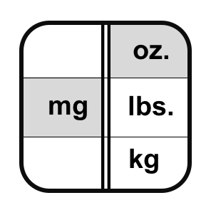

<!--
  ~ Licensed to the Apache Software Foundation (ASF) under one or more
  ~ contributor license agreements.  See the NOTICE file distributed with
  ~ this work for additional information regarding copyright ownership.
  ~ The ASF licenses this file to You under the Apache License, Version 2.0
  ~ (the "License"); you may not use this file except in compliance with
  ~ the License.  You may obtain a copy of the License at
  ~
  ~    http://www.apache.org/licenses/LICENSE-2.0
  ~
  ~ Unless required by applicable law or agreed to in writing, software
  ~ distributed under the License is distributed on an "AS IS" BASIS,
  ~ WITHOUT WARRANTIES OR CONDITIONS OF ANY KIND, either express or implied.
  ~ See the License for the specific language governing permissions and
  ~ limitations under the License.
  ~
  -->

## Maßeinheiten-Umrechner

<p align="center">
    
</p>

***

## Beschreibung

Der Maßeinheiten-Umrechner-Prozessor wandelt Werte automatisch zwischen verschiedenen Maßeinheiten um. Er unterstützt alle Einheitentypen, die mit der Maßeinheit des Eingabefelds kompatibel sind, einschließlich:

* Länge (Meter, Fuß, Zoll, etc.)
* Masse (Kilogramm, Pfund, Unzen, etc.)
* Temperatur (Celsius, Fahrenheit, Kelvin)
* Volumen (Liter, Gallonen, Kubikmeter, etc.)
* Druck (Pascal, Bar, PSI, etc.)
* Geschwindigkeit (m/s, km/h, mph, etc.)
* Fläche (Quadratmeter, Hektar, etc.)
* Zeit (Sekunden, Minuten, Stunden, etc.)
* Energie (Joule, Kilowattstunden, etc.)
* Leistung (Watt, Pferdestärken, etc.)

Dieser Prozessor ist essentiell für:
* Standardisierung von Messungen über Systeme hinweg
* Umrechnung zwischen internationalen und US-Einheiten
* Sicherstellung konsistenter Datenrepräsentation
* Unterstützung mehrerer Regionen
* Ermöglichung von Systeminteroperabilität

***

## Erforderliche Eingabe

Der Prozessor benötigt:
1. Ein numerisches Feld mit definierter Maßeinheit
2. Das Feld muss vom Typ Messgröße sein

***

## Konfiguration

### Feld

Wähle das numerische Feld aus, das den umzuwandelnden Wert enthält. Das Feld muss eine definierte Maßeinheit haben.

### Ausgabeeinheit

Wähle die gewünschte Maßeinheit für den Ausgabewert. Die verfügbaren Einheiten werden dynamisch basierend auf dem Einheitentyp des Eingabefelds gefüllt.

## Ausgabe

Der Prozessor erstellt eine neue Nachricht, die enthält:
* Alle ursprünglichen Felder aus der Eingabe-Nachricht
* Das ausgewählte Feld wird mit dem umgerechneten Wert aktualisiert

### Beispiel

#### Eingabe-Nachricht
```json
{
  "sensorId": "temp01",
  "temperature": 20.0,
  "humidity": 65,
  "timestamp": 1586380104915
}
```

#### Konfiguration
* Feld: temperature (mit Einheit Celsius)
* Ausgabeeinheit: Fahrenheit

#### Ausgabe-Nachricht
```json
{
  "sensorId": "temp01",
  "temperature": 68.0,
  "humidity": 65,
  "timestamp": 1586380104915
}
```

## Anwendungsfälle

1. **Internationale Operationen**
   * Umrechnung zwischen metrischen und imperialen Einheiten
   * Standardisierung von Messungen über Regionen hinweg
   * Unterstützung globaler Datenanalyse
   * Ermöglichung von Multi-Markt-Compliance

2. **Systemintegration**
   * Umrechnung zwischen verschiedenen Systemstandards
   * Normalisierung von Daten aus mehreren Quellen
   * Ermöglichung plattformübergreifender Kompatibilität
   * Unterstützung der Integration von Altsystemen

3. **Wissenschaftliche Anwendungen**
   * Umrechnung zwischen wissenschaftlichen Einheiten
   * Unterstützung experimenteller Datenanalyse
   * Ermöglichung disziplinübergreifender Zusammenarbeit
   * Aufrechterhaltung der Messgenauigkeit

4. **Industrielle Prozesse**
   * Umrechnung von Prozessmessungen
   * Standardisierung von Steuerungsparametern
   * Unterstützung der Geräteinteroperabilität
   * Ermöglichung herstellerübergreifender Integration

## Hinweise

* Das Eingabefeld muss eine definierte Maßeinheit haben
* Nur kompatible Einheiten sind zur Auswahl verfügbar
* Die Umrechnung erfolgt direkt
* Der ursprüngliche Wert wird durch den umgerechneten Wert ersetzt
* Alle Umrechnungen behalten die numerische Genauigkeit bei
* Umrechnungsformeln folgen internationalen Standards
* Ungültige Einheitskombinationen werden abgelehnt
* Nullwerte werden in der Ausgabe beibehalten
* Die Umrechnung ist zustandslos
* Die Umrechnungsgenauigkeit hängt von der Eingabegenauigkeit ab
* Temperaturumrechnungen berücksichtigen sowohl relative als auch absolute Skalen 