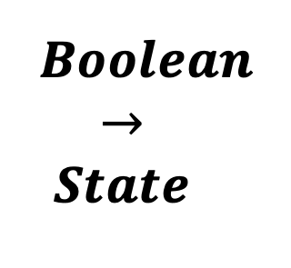

<!--
  ~ Licensed to the Apache Software Foundation (ASF) under one or more
  ~ contributor license agreements.  See the NOTICE file distributed with
  ~ this work for additional information regarding copyright ownership.
  ~ The ASF licenses this file to You under the Apache License, Version 2.0
  ~ (the "License"); you may not use this file except in compliance with
  ~ the License.  You may obtain a copy of the License at
  ~
  ~    http://www.apache.org/licenses/LICENSE-2.0
  ~
  ~ Unless required by applicable law or agreed to in writing, software
  ~ distributed under the License is distributed on an "AS IS" BASIS,
  ~ WITHOUT WARRANTIES OR CONDITIONS OF ANY KIND, either express or implied.
  ~ See the License for the specific language governing permissions and
  ~ limitations under the License.
  ~
  -->

## Boolescher zu Zustand

<p align="center">
    
</p>

***

## Beschreibung

Der Boolescher-zu-Zustand-Prozessor wandelt boolesche Felder in einen beschreibenden Zustandsstring um. Er unterstützt:
* Mehrere boolesche Eingaben
* Benutzerdefinierte Zustandsabbildung
* Standardzustandsbehandlung
* Laufzeitnamen-Abbildung
* JSON-Konfiguration
* Zustandspriorisierung

Dieser Prozessor ist essentiell für:
* Umwandlung boolescher Zustände
* Erstellung beschreibender Zustände
* Abbildung boolescher Werte
* Behandlung mehrerer Zustände
* Aufbau von Zustandsautomaten
* Erstellung menschenlesbarer Zustände

***

## Erforderliche Eingabe

Der Prozessor benötigt einen Datenstrom, der mindestens ein boolesches Feld zur Umwandlung in einen Zustand enthält.

***

## Konfiguration

### Aktueller Zustand

Wähle ein oder mehrere boolesche Felder zur Überwachung aus. Wenn ein Feld true ist, wird sein Laufzeitname als Zustandswert verwendet. Wenn mehrere Felder true sind, wird das erste in der Liste verwendet.

### Standardzustand

Definiere einen Standardzustandsstring, der verwendet wird, wenn alle booleschen Felder false sind. Dies stellt sicher, dass immer ein Zustand in der Ausgabe vorhanden ist.

### Zuordnungs-Konfiguration

Definiere benutzerdefinierte Zuordnungen, um die Laufzeitnamen durch eigene Zustandsstrings zu ersetzen. Verwende das JSON-Format:

```json
{
    "runtimeName1": "Benutzerdefinierter Zustand 1",
    "runtimeName2": "Benutzerdefinierter Zustand 2"
}
```

## Ausgabe

Der Prozessor erstellt eine neue Nachricht, die enthält:
* Alle ursprünglichen Felder aus der Eingabe-Nachricht
* Ein neues Feld namens "current_state" mit dem Zustandsstring

### Beispiel

#### Eingabe-Nachricht
```json
{
  "deviceId": "machine01",
  "isRunning": true,
  "isError": false,
  "isMaintenance": false,
  "timestamp": 1586380104915
}
```

#### Konfiguration
* Aktueller Zustand: isRunning, isError, isMaintenance
* Standardzustand: "IDLE"
* Zuordnungs-Konfiguration:
```json
{
    "isRunning": "OPERATIONAL",
    "isError": "ERROR",
    "isMaintenance": "MAINTENANCE"
}
```

#### Ausgabe-Nachricht
```json
{
  "deviceId": "machine01",
  "isRunning": true,
  "isError": false,
  "isMaintenance": false,
  "timestamp": 1586380104915,
  "current_state": "OPERATIONAL"
}
```

## Anwendungsfälle

1. **Geräteüberwachung**
   * Umwandlung von Gerätezuständen
   * Abbildung von Statusflags
   * Erstellung von Zustandsautomaten
   * Überwachung von Bedingungen
   * Verfolgung von Operationen

2. **Prozesssteuerung**
   * Abbildung von Prozesszuständen
   * Umwandlung von Bedingungen
   * Erstellung von Arbeitsabläufen
   * Überwachung von Phasen
   * Verfolgung des Fortschritts

3. **Systemintegration**
   * Abbildung von Systemzuständen
   * Umwandlung von Signalen
   * Erstellung von Schnittstellen
   * Überwachung des Status
   * Verfolgung von Bedingungen

4. **Qualitätskontrolle**
   * Abbildung von Qualitätszuständen
   * Umwandlung von Prüfungen
   * Erstellung von Berichten
   * Überwachung von Tests
   * Verfolgung von Ergebnissen

## Hinweise

* Nur boolesche Felder können umgewandelt werden
* Zustandsabbildung ist case-sensitive
* Standardzustand ist erforderlich
* JSON-Konfiguration ist optional
* Verarbeitung ist zustandslos
* Mehrere Zustände erfordern Priorisierung
* Zustandsbenennung beachten
* Abbildung erfolgt sofort
* Keine Verzögerung bei der Verarbeitung
* Zustand ist immer vorhanden 