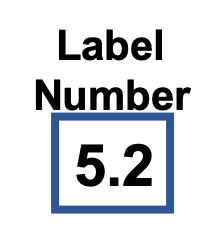

<!--
  ~ Licensed to the Apache Software Foundation (ASF) under one or more
  ~ contributor license agreements.  See the NOTICE file distributed with
  ~ this work for additional information regarding copyright ownership.
  ~ The ASF licenses this file to You under the Apache License, Version 2.0
  ~ (the "License"); you may not use this file except in compliance with
  ~ the License.  You may obtain a copy of the License at
  ~
  ~    http://www.apache.org/licenses/LICENSE-2.0
  ~
  ~ Unless required by applicable law or agreed to in writing, software
  ~ distributed under the License is distributed on an "AS IS" BASIS,
  ~ WITHOUT WARRANTIES OR CONDITIONS OF ANY KIND, either express or implied.
  ~ See the License for the specific language governing permissions and
  ~ limitations under the License.
  ~
  -->

## Zahlen-Beschriftung

<p align="center">
    
</p>

***

## Beschreibung

Der Zahlen-Beschriftungs-Prozessor fügt Beschriftungen zu numerischen Werten basierend auf benutzerdefinierten Regeln hinzu. Er unterstützt:
* Wertbasierte Beschriftung
* Benutzerdefinierte Regeldefinition
* Mehrere Bedingungen
* Standardbeschriftungen
* Wertvergleich

Dieser Prozessor ist essentiell für:
* Messungen klassifizieren
* Kontext zu Daten hinzufügen
* Muster identifizieren
* Bedingungen markieren

***

## Erforderliche Eingabe

Der Prozessor benötigt einen Datenstrom, der enthält:
* Ein numerisches Wertfeld zur Auswertung
* Zeitstempelinformationen

***

## Konfiguration

### Sensorwert

Wähle das numerische Feld aus, das gegen die Regeln ausgewertet werden soll.

### Beschriftungsname

Gib den Namen des Beschriftungsfelds in der Ausgabe-Nachricht an.

### Bedingung

Füge Bedingungen im Format hinzu:
* `<;5;niedrig` - Als "niedrig" beschriften, wenn der Wert kleiner als 5 ist
* `<;10;mittel` - Als "mittel" beschriften, wenn der Wert kleiner als 10 ist
* `*;hoch` - Standardbeschriftung "hoch" für alle anderen Fälle

## Ausgabe

Der Prozessor erstellt eine neue Nachricht, die enthält:
* Alle ursprünglichen Felder aus der Eingabe-Nachricht
* Ein neues Beschriftungsfeld basierend auf den Bedingungen

### Beispiel

#### Eingabe-Nachricht
```json
{
  "deviceId": "sensor01",
  "timestamp": 1586380104915,
  "temperature": 23.5
}
```

#### Konfiguration
* Sensorwert: temperature
* Beschriftungsname: temperature_status
* Bedingung: "<;20;kalt", "<;30;warm", "*;heiß"

#### Ausgabe-Nachricht
```json
{
  "deviceId": "sensor01",
  "timestamp": 1586380104915,
  "temperature": 23.5,
  "temperature_status": "warm"
}
```

## Anwendungsfälle

1. **Datenklassifizierung**
   * Messungen klassifizieren
   * Kontext zu Daten hinzufügen
   * Muster identifizieren
   * Bedingungen markieren

2. **Qualitätskontrolle**
   * Qualitätsstufen beschriften
   * Schwellenwerte markieren
   * Probleme identifizieren
   * Bedingungen verfolgen

## Hinweise

* Bedingungen werden in Reihenfolge ausgewertet
* Standardbeschriftung ist erforderlich
* Verarbeitung ist zustandslos
* Mehrere Bedingungen werden unterstützt 