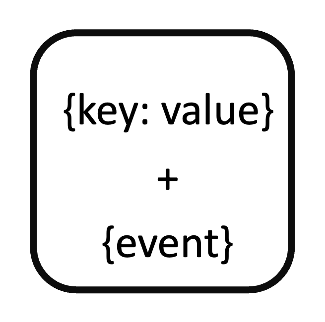

<!--
  ~ Licensed to the Apache Software Foundation (ASF) under one or more
  ~ contributor license agreements.  See the NOTICE file distributed with
  ~ this work for additional information regarding copyright ownership.
  ~ The ASF licenses this file to You under the Apache License, Version 2.0
  ~ (the "License"); you may not use this file except in compliance with
  ~ the License.  You may obtain a copy of the License at
  ~
  ~    http://www.apache.org/licenses/LICENSE-2.0
  ~
  ~ Unless required by applicable law or agreed to in writing, software
  ~ distributed under the License is distributed on an "AS IS" BASIS,
  ~ WITHOUT WARRANTIES OR CONDITIONS OF ANY KIND, either express or implied.
  ~ See the License for the specific language governing permissions and
  ~ limitations under the License.
  ~
  -->
## Statischer Metadaten-Anreicherer

<p align="center">
    
</p>

***

## Beschreibung

Der Statische Metadaten-Anreicherer-Prozessor fügt vordefinierten Metadatenfeldern zu Nachrichten hinzu. Er unterstützt:
* Benutzerdefinierte Feldhinzufügung
* Mehrere Datentypen (String, Boolean, Float, Integer)
* Feldbezeichnung
* Feldbeschreibungen
* Laufzeitbenennung
* Metadatenanreicherung

Dieser Prozessor ist essentiell für:
* Hinzufügen von Kontext zu Daten
* Anreichern von Nachrichten
* Erstellen von Metadaten
* Erstellen von Anmerkungen
* Standardisieren von Feldern
* Dokumentieren von Daten

***

## Erforderliche Eingabe

Der Prozessor benötigt einen Datenstrom, der mit zusätzlichen Metadatenfeldern angereichert werden soll.

***

## Konfiguration

### Metadaten-Eingabe

Konfiguriere die Metadatenfelder, die zu jeder Nachricht hinzugefügt werden sollen:

#### Laufzeitname
Gib den Namen ein, der für das Feld in der Ausgabe-Nachricht verwendet wird.

#### Laufzeitwert
Gib den Wert ein, der dem Feld zugewiesen wird.

#### Datentyp
Wähle den Datentyp des Wertes:
* String: Textwerte
* Boolean: true/false-Werte
* Float: Dezimalzahlen
* Integer: Ganze Zahlen

#### Bezeichnung (Optional)
Gib eine kurze Bezeichnung an, die das Feld beschreibt.

#### Beschreibung (Optional)
Gib eine detaillierte Beschreibung des Feldes an.

## Ausgabe

Der Prozessor erstellt eine neue Nachricht, die enthält:
* Alle ursprünglichen Felder aus der Eingabe-Nachricht
* Die konfigurierten Metadatenfelder mit ihren Werten

### Beispiel

#### Eingabe-Nachricht
```json
{
  "deviceId": "sensor01",
  "temperature": 23.5,
  "humidity": 45.2
}
```

#### Konfiguration
* Laufzeitname: location
* Laufzeitwert: Building A
* Datentyp: String
* Bezeichnung: Sensorstandort
* Beschreibung: Physischer Standort des Sensors

#### Ausgabe-Nachricht
```json
{
  "deviceId": "sensor01",
  "temperature": 23.5,
  "humidity": 45.2,
  "location": "Building A"
}
```

## Anwendungsfälle

1. **Datenanreicherung**
   * Kontext zu Daten hinzufügen
   * Nachrichten anreichern
   * Metadaten erstellen
   * Anmerkungen erstellen
   * Felder standardisieren

2. **Dokumentation**
   * Daten dokumentieren
   * Beschreibungen hinzufügen
   * Bezeichnungen erstellen
   * Metadaten erstellen
   * Felder standardisieren

## Hinweise

* Mehrere Felder können hinzugefügt werden
* Datentypen müssen zu Werten passen
* Bezeichnungen sind optional
* Beschreibungen sind optional
* Verarbeitung ist zustandslos
* Feldnamen müssen eindeutig sein
* Werte werden automatisch in den ausgewählten Datentyp umgewandelt
* Ursprüngliche Nachrichtfelder werden beibehalten
* Metadaten sind über alle Nachrichten hinweg konsistent 