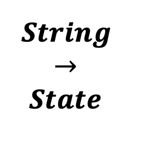

<!--
  ~ Licensed to the Apache Software Foundation (ASF) under one or more
  ~ contributor license agreements.  See the NOTICE file distributed with
  ~ this work for additional information regarding copyright ownership.
  ~ The ASF licenses this file to You under the Apache License, Version 2.0
  ~ (the "License"); you may not use this file except in compliance with
  ~ the License.  You may obtain a copy of the License at
  ~
  ~    http://www.apache.org/licenses/LICENSE-2.0
  ~
  ~ Unless required by applicable law or agreed to in writing, software
  ~ distributed under the License is distributed on an "AS IS" BASIS,
  ~ WITHOUT WARRANTIES OR CONDITIONS OF ANY KIND, either express or implied.
  ~ See the License for the specific language governing permissions and
  ~ limitations under the License.
  ~
  -->

## String zu Zustand

<p align="center">
    
</p>

***

## Beschreibung

Der String-zu-Zustand-Prozessor wandelt String-Eigenschaften in eine Liste von Zustandswerten um. Er unterstützt:
* Mehrere String-Eingaben
* Listenbasierte Zustandsausgabe
* Feldwertbeibehaltung
* Zustandssammlung

Dieser Prozessor ist essentiell für:
* Konvertieren von Strings in Zustände
* Sammeln mehrerer Zustände
* Beibehalten von Feldwerten
* Erstellen von Zustandslisten

***

## Erforderliche Eingabe

Der Prozessor benötigt einen Datenstrom, der mindestens ein String-Feld enthält, das in einen Zustand umgewandelt werden soll.

***

## Konfiguration

### Zustandsfeld

Wähle ein oder mehrere String-Felder aus, die in Zustände umgewandelt werden sollen. Die Werte dieser Felder werden in eine Liste von Zuständen gesammelt.

## Ausgabe

Der Prozessor erstellt eine neue Nachricht, die enthält:
* Alle ursprünglichen Felder aus der Eingabe-Nachricht
* Ein neues Feld namens "current_state", das eine Liste der ausgewählten String-Feldwerte enthält

### Beispiel

#### Eingabe-Nachricht
```json
{
  "deviceId": "sensor01",
  "status": "running",
  "mode": "normal"
}
```

#### Konfiguration
* Zustandsfelder: status, mode

#### Ausgabe-Nachricht
```json
{
  "deviceId": "sensor01",
  "status": "running",
  "mode": "normal",
  "current_state": ["running", "normal"]
}
```

## Anwendungsfälle

1. **Zustandssammlung**
   * Mehrere Zustände sammeln
   * Feldwerte verfolgen
   * Status überwachen
   * Modi sammeln

2. **Zustandsanalyse**
   * Zustandskombinationen analysieren
   * Wertmuster verfolgen
   * Feldänderungen überwachen
   * Zustandslisten verarbeiten

## Hinweise

* Mehrere Felder können ausgewählt werden
* Ausgabe ist immer eine Liste
* Ursprüngliche Felder werden beibehalten
* Verarbeitung ist zustandslos
* Leere Auswahlen ergeben eine leere Liste
* Feldwerte werden unverändert beibehalten 