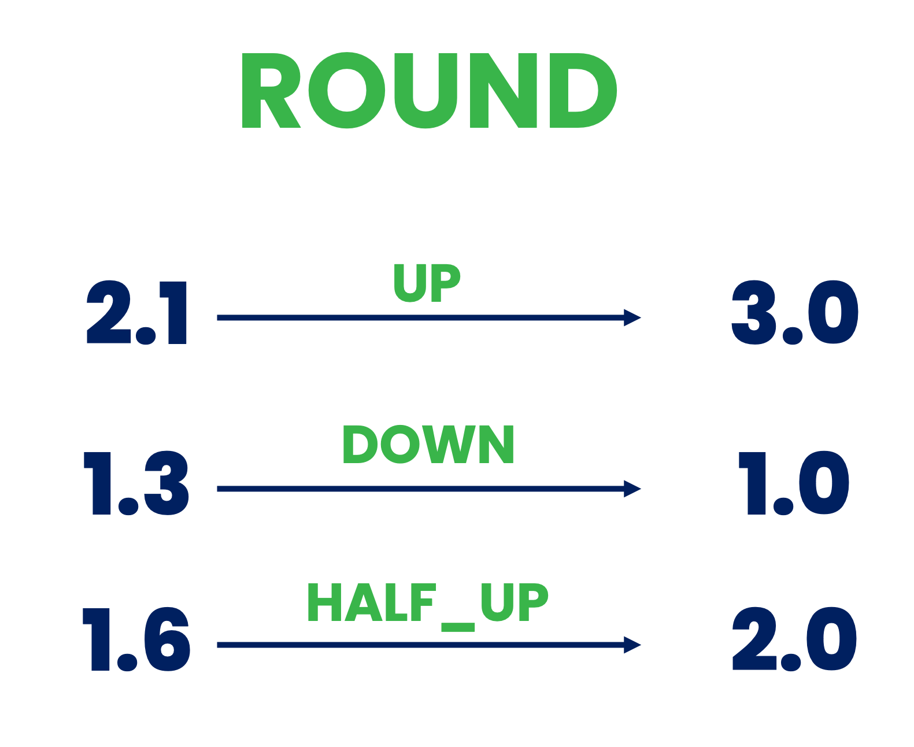

<!--
  ~ Licensed to the Apache Software Foundation (ASF) under one or more
  ~ contributor license agreements.  See the NOTICE file distributed with
  ~ this work for additional information regarding copyright ownership.
  ~ The ASF licenses this file to You under the Apache License, Version 2.0
  ~ (the "License"); you may not use this file except in compliance with
  ~ the License.  You may obtain a copy of the License at
  ~
  ~    http://www.apache.org/licenses/LICENSE-2.0
  ~
  ~ Unless required by applicable law or agreed to in writing, software
  ~ distributed under the License is distributed on an "AS IS" BASIS,
  ~ WITHOUT WARRANTIES OR CONDITIONS OF ANY KIND, either express or implied.
  ~ See the License for the specific language governing permissions and
  ~ limitations under the License.
  ~
  -->

## Zahlenrundung

<p align="center">
    
</p>

***

## Beschreibung

Der Zahlenrundungs-Prozessor bietet präzise Kontrolle über die Dezimalstellen in numerischen Daten durch Anwendung verschiedener Rundungsstrategien. Dies ist essentiell für:
* Sicherstellung konsistenter Genauigkeit in numerischen Daten
* Reduzierung von Rauschen in Messungen
* Verbesserung der Lesbarkeit von Daten
* Erfüllung spezifischer geschäftlicher oder technischer Anforderungen an numerische Genauigkeit
* Standardisierung numerischer Ausgaben für die weitere Verarbeitung

***

## Erforderliche Eingabe

Dieser Prozessor benötigt eine Nachricht, die eine oder mehrere numerische Eigenschaften (Ganzzahlen oder Fließkommazahlen) enthält.

***

## Konfiguration

### Zu rundende Felder

Wähle aus, welche numerischen Felder in der Nachricht gerundet werden sollen. Es können mehrere Felder ausgewählt werden, und jedes wird gemäß der gleichen Konfiguration gerundet.

### Anzahl der Stellen

Gib die Anzahl der Dezimalstellen an, die nach dem Runden beibehalten werden sollen. Dies bestimmt die Genauigkeit der Ausgabe:
* Positive Werte (z.B. 2): Behält so viele Dezimalstellen
* Null (0): Rundet auf ganze Zahlen
* Negative Werte (z.B. -2): Rundet auf Zehner, Hunderter, etc.

Beispiele:
* Eingabe: 2.8935, Stellen: 3 → Ausgabe: 2.894
* Eingabe: 2.8935, Stellen: 2 → Ausgabe: 2.89
* Eingabe: 2.8935, Stellen: 0 → Ausgabe: 3
* Eingabe: 285.8935, Stellen: -2 → Ausgabe: 300

### Rundungsmodus

Wähle die anzuwendende Rundungsstrategie. Jeder Modus behandelt das Runden unterschiedlich, besonders bei Werten zwischen zwei Zahlen:

* **AUFWÄRTS** 
  * Rundet immer von Null weg
  * 3.1 → 4, -3.1 → -4
  * Verwende dies, wenn du sicherstellen musst, dass das Ergebnis nie kleiner im Betrag ist

* **ABWÄRTS**
  * Rundet immer gegen Null (kürzt ab)
  * 3.7 → 3, -3.7 → -3
  * Verwende dies, wenn du sicherstellen musst, dass das Ergebnis nie größer im Betrag ist

* **DEKEN**
  * Rundet immer gegen positive Unendlichkeit
  * 3.1 → 4, -3.7 → -3
  * Verwende dies, wenn du sicherstellen musst, dass das Ergebnis nie abnimmt

* **BODEN**
  * Rundet immer gegen negative Unendlichkeit
  * 3.7 → 3, -3.1 → -4
  * Verwende dies, wenn du sicherstellen musst, dass das Ergebnis nie zunimmt

* **HALB_AUFWÄRTS** (Am häufigsten verwendet)
  * Rundet zur nächsten Zahl, bei Gleichheit wird aufgerundet
  * 3.5 → 4, 3.4 → 3, -3.5 → -4
  * Verwende dies für Standard-Mathematik-Rundung

* **HALB_ABWÄRTS**
  * Rundet zur nächsten Zahl, bei Gleichheit wird abgerundet
  * 3.5 → 3, 3.6 → 4, -3.5 → -3
  * Verwende dies, wenn Gleichstände abgerundet werden sollen

* **HALB_GERADE** (Banker's Rounding)
  * Rundet zur nächsten Zahl, bei Gleichheit wird zur geraden Nachbarzahl gerundet
  * 3.5 → 4, 4.5 → 4, -3.5 → -4
  * Verwende dies, um kumulative Rundungsfehler in großen Datensätzen zu minimieren

## Ausgabe

Der Prozessor gibt eine Nachricht mit der gleichen Struktur wie die Eingabe aus, aber mit den ausgewählten numerischen Feldern, die gemäß der Konfiguration gerundet wurden. Alle anderen Felder bleiben unverändert.

### Beispiel

#### Eingabe-Nachricht
```json
{
  "sensorId": "temp01",
  "temperature": 23.4567,
  "pressure": 1013.8935,
  "humidity": 45.5000
}
```

#### Konfiguration
* Zu rundende Felder: temperature, pressure
* Anzahl der Stellen: 2
* Rundungsmodus: HALF_UP

#### Ausgabe-Nachricht
```json
{
  "sensorId": "temp01",
  "temperature": 23.46,
  "pressure": 1013.89,
  "humidity": 45.5000
}
```

## Anwendungsfälle

1. **Messdaten**: Standardisierung der Genauigkeit von Sensormessungen
2. **Finanzberechnungen**: Sicherstellung korrekter Dezimalbehandlung bei Geldwerten
3. **Wissenschaftliche Analyse**: Kontrolle signifikanter Stellen in experimentellen Daten
4. **Anzeigeformatierung**: Vorbereitung von Zahlen für Benutzeroberflächen
5. **Datenspeicherung**: Optimierung numerischer Genauigkeit für Speichereffizienz 