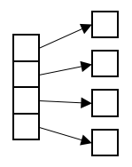

<!--
  ~ Licensed to the Apache Software Foundation (ASF) under one or more
  ~ contributor license agreements.  See the NOTICE file distributed with
  ~ this work for additional information regarding copyright ownership.
  ~ The ASF licenses this file to You under the Apache License, Version 2.0
  ~ (the "License"); you may not use this file except in compliance with
  ~ the License.  You may obtain a copy of the License at
  ~
  ~    http://www.apache.org/licenses/LICENSE-2.0
  ~
  ~ Unless required by applicable law or agreed to in writing, software
  ~ distributed under the License is distributed on an "AS IS" BASIS,
  ~ WITHOUT WARRANTIES OR CONDITIONS OF ANY KIND, either express or implied.
  ~ See the License for the specific language governing permissions and
  ~ limitations under the License.
  ~
  -->

## Array aufteilen

<p align="center">
    
</p>

***

## Beschreibung

Der Array-aufteilen-Prozessor wandelt Array-Felder in mehrere einzelne Nachrichten um, wobei jedes Array-Element zu einer separaten Nachricht wird. Er unterstützt:
* Array-Element-Extraktion
* Kontext-Erhaltung
* Verschachtelte Feldbehandlung
* Benutzerdefinierte Feldbenennung

Dieser Prozessor ist essentiell für:
* Umwandlung von Batch-Daten in einzelne Nachrichten
* Unabhängige Verarbeitung von Array-Elementen
* Verteilung von Array-Daten über Streams
* Ermöglichung von elementweiser Analyse

***

## Erforderliche Eingabe

Der Prozessor benötigt einen Datenstrom, der mindestens ein Array-Feld enthält. Das Array kann Elemente jeden unterstützten Datentyps enthalten:
* Zahlen (Ganzzahlen oder Fließkommazahlen)
* Strings
* Boolesche Werte
* Objekte
* Verschachtelte Arrays

***

## Konfiguration

### Array-Feld-Auswahl

Wähle das Array-Feld aus, das in einzelne Nachrichten aufgeteilt werden soll. Das Feld muss vom Typ Array sein.

### Felder beibehalten

Wähle ein oder mehrere Felder aus der Eingabe-Nachricht aus, die in jeder Ausgabe-Nachricht beibehalten werden sollen. Diese Felder werden in jede Ausgabe-Nachricht kopiert.

## Ausgabe

Für jedes Element im Eingabe-Array erstellt der Prozessor eine neue Nachricht, die enthält:
* Das Array-Element als einzelnen Wert in einem Feld namens "array_value"
* Alle ausgewählten Felder aus der ursprünglichen Nachricht

### Beispiel

#### Eingabe-Nachricht
```json
{
  "deviceId": "sensor123",
  "timestamp": 1586380104915,
  "measurements": [22.5, 23.1, 22.8, 23.4],
  "status": "active"
}
```

#### Konfiguration
* Array-Feld: measurements
* Beizubehaltende Felder: deviceId, timestamp, status

#### Ausgabe-Nachrichten
```json
// Erstes Element
{
  "deviceId": "sensor123",
  "timestamp": 1586380104915,
  "status": "active",
  "array_value": 22.5
}

// Zweites Element
{
  "deviceId": "sensor123",
  "timestamp": 1586380104915,
  "status": "active",
  "array_value": 23.1
}

// Drittes Element
{
  "deviceId": "sensor123",
  "timestamp": 1586380104915,
  "status": "active",
  "array_value": 22.8
}

// Viertes Element
{
  "deviceId": "sensor123",
  "timestamp": 1586380104915,
  "status": "active",
  "array_value": 23.4
}
```

## Anwendungsfälle

1. **Batch-Verarbeitung**
   * Aufteilen von Batch-Sensormessungen
   * Verarbeitung von Multi-Messungsdaten
   * Handhabung gruppierter Beobachtungen
   * Umwandlung von Batch-Uploads

2. **Datenverteilung**
   * Verteilung der Arbeitslast auf Prozessoren
   * Ermöglichung paralleler Verarbeitung
   * Ausgleich der Verarbeitungslast
   * Skalierung der Datenverarbeitung

## Hinweise

* Ausgabe-Nachrichten behalten die ursprüngliche Reihenfolge bei
* Leere Arrays erzeugen keine Ausgabe-Nachrichten
* Null-Array-Elemente werden beibehalten
* Verarbeitung ist zustandslos
* Speichernutzung skaliert mit Array-Größe
* Verschachtelte Felder werden automatisch behandelt 