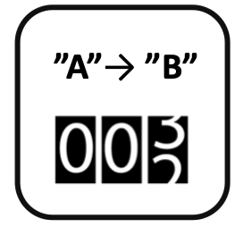

<!--
  ~ Licensed to the Apache Software Foundation (ASF) under one or more
  ~ contributor license agreements.  See the NOTICE file distributed with
  ~ this work for additional information regarding copyright ownership.
  ~ The ASF licenses this file to You under the Apache License, Version 2.0
  ~ (the "License"); you may not use this file except in compliance with
  ~ the License.  You may obtain a copy of the License at
  ~
  ~    http://www.apache.org/licenses/LICENSE-2.0
  ~
  ~ Unless required by applicable law or agreed to in writing, software
  ~ distributed under the License is distributed on an "AS IS" BASIS,
  ~ WITHOUT WARRANTIES OR CONDITIONS OF ANY KIND, either express or implied.
  ~ See the License for the specific language governing permissions and
  ~ limitations under the License.
  ~
  -->

## String-Zähler

<p align="center">
    
</p>

***

## Beschreibung

Der String-Zähler-Prozessor zählt Änderungen in String-Feldwerten. Er unterstützt:
* Wertänderungserkennung
* Änderungspaar-Verfolgung
* Inkrementelles Zählen
* Zustandsübergangsüberwachung

Dieser Prozessor ist essentiell für:
* Zählen von Wertänderungen
* Verfolgen von Zustandsübergängen
* Überwachen von String-Mustern
* Messen der Änderungshäufigkeit

***

## Erforderliche Eingabe

Der Prozessor benötigt einen Datenstrom, der mindestens ein String-Feld enthält, das auf Wertänderungen überwacht werden soll.

***

## Konfiguration

### String-Feld

Wähle das String-Feld aus, das auf Wertänderungen überwacht werden soll. Dieses Feld wird verwendet, um Änderungen zu erkennen und den Zähler zu erhöhen.

## Ausgabe

Der Prozessor erstellt eine neue Nachricht, die enthält:
* Alle ursprünglichen Felder aus der Eingabe-Nachricht
* Ein neues Feld namens "counter" mit der aktuellen Anzahl der Wertänderungen
* Ein neues Feld namens "change_from" mit dem vorherigen Wert
* Ein neues Feld namens "change_to" mit dem neuen Wert

### Beispiel

#### Eingabe-Nachrichtenstrom
```json
{
  "deviceId": "sensor01",
  "status": "idle"
}
```
```json
{
  "deviceId": "sensor01",
  "status": "running"
}
```
```json
{
  "deviceId": "sensor01",
  "status": "idle"
}
```

#### Konfiguration
* String-Feld: status

#### Ausgabe-Nachricht
```json
{
  "deviceId": "sensor01",
  "status": "running",
  "change_from": "idle",
  "change_to": "running",
  "counter": 1
}
```
```json
{
  "deviceId": "sensor01",
  "status": "idle",
  "change_from": "running",
  "change_to": "idle",
  "counter": 2
}
```

## Anwendungsfälle

1. **Zustandsüberwachung**
   * Verfolgen von Zustandsänderungen
   * Zählen von Übergängen
   * Überwachen von Mustern
   * Messen der Häufigkeit

2. **Prozessanalyse**
   * Analysieren von Arbeitsabläufen
   * Verfolgen von Sequenzen
   * Zählen von Zyklen
   * Überwachen von Operationen

## Hinweise

* Zählt nur tatsächliche Wertänderungen
* Ignoriert aufeinanderfolgende identische Werte
* Verarbeitung ist zustandsbehaftet
* Zähler ist inkrementell
* Nachrichten werden nur bei Wertänderungen ausgegeben
* Ursprüngliche Nachrichtfelder werden beibehalten
* Änderungspaare werden verfolgt (von -> zu)
* Zähler beginnt bei 1 für die erste Änderung 