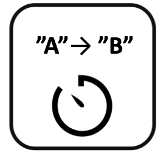

<!--
  ~ Licensed to the Apache Software Foundation (ASF) under one or more
  ~ contributor license agreements.  See the NOTICE file distributed with
  ~ this work for additional information regarding copyright ownership.
  ~ The ASF licenses this file to You under the Apache License, Version 2.0
  ~ (the "License"); you may not use this file except in compliance with
  ~ the License.  You may obtain a copy of the License at
  ~
  ~    http://www.apache.org/licenses/LICENSE-2.0
  ~
  ~ Unless required by applicable law or agreed to in writing, software
  ~ distributed under the License is distributed on an "AS IS" BASIS,
  ~ WITHOUT WARRANTIES OR CONDITIONS OF ANY KIND, either express or implied.
  ~ See the License for the specific language governing permissions and
  ~ limitations under the License.
  ~
  -->

## String-Timer

<p align="center">
    
</p>

***

## Beschreibung

Der String-Timer-Prozessor misst, wie lange ein String-Feld einen bestimmten Wert beibehält. Er unterstützt:
* String-Wertüberwachung
* Zeitmessung
* Mehrere Zeiteinheiten
* Konfigurierbare Ausgabefrequenz

Dieser Prozessor ist essentiell für:
* Messen von Zustandsdauern
* Verfolgen von Wertbeständigkeit
* Überwachen von String-Zuständen
* Berechnen von Zeiträumen

***

## Erforderliche Eingabe

Der Prozessor benötigt einen Datenstrom, der mindestens ein String-Feld enthält, das auf Wertänderungen überwacht werden soll.

***

## Konfiguration

### String-Feld

Wähle das String-Feld aus, das auf Wertänderungen überwacht werden soll. Dieses Feld wird verwendet, um zu messen, wie lange es einen bestimmten Wert beibehält.

### Ausgabeeinheit

Wähle die Zeiteinheit für die gemessene Dauer:
* Millisekunden (Standard)
* Sekunden
* Minuten

### Ausgabefrequenz

Definiere, wann der Prozessor eine Ausgabe-Nachricht senden soll:
* Bei Eingabe-Nachricht: Sende für jede Eingabe-Nachricht
* Bei String-Wertänderung: Sende nur bei Änderung des String-Werts

## Ausgabe

Der Prozessor erstellt eine neue Nachricht, die enthält:
* Alle ursprünglichen Felder aus der Eingabe-Nachricht
* Ein measured_time-Feld, das die Dauer in der gewählten Einheit anzeigt
* Ein field_value-Feld, das den vorherigen String-Wert anzeigt

### Beispiel

#### Eingabe-Nachricht
```json
{
  "deviceId": "machine01",
  "status": "running",
  "timestamp": 1586380104915
}
```

#### Konfiguration
* String-Feld: status
* Ausgabeeinheit: Sekunden
* Ausgabefrequenz: Bei String-Wertänderung

#### Ausgabe-Nachricht (wenn sich status von "running" zu "stopped" ändert)
```json
{
  "deviceId": "machine01",
  "status": "stopped",
  "timestamp": 1586380106915,
  "measured_time": 2.0,
  "field_value": "running"
}
```

## Anwendungsfälle

1. **Zustandsüberwachung**
   * Messen von Zustandsdauern
   * Verfolgen von Wertbeständigkeit
   * Überwachen von Statusänderungen
   * Berechnen von Zeiträumen

2. **Prozesssteuerung**
   * Messen von Prozessdauern
   * Verfolgen von Zustandsänderungen
   * Überwachen von Operationen
   * Berechnen von Zeiten

## Hinweise

* Nur String-Felder können überwacht werden
* Zeitmessung ist zustandsbehaftet
* Messung beginnt bei Wertänderung
* Messung endet bei nächster Änderung
* Ausgabe hängt von der Frequenzeinstellung ab 