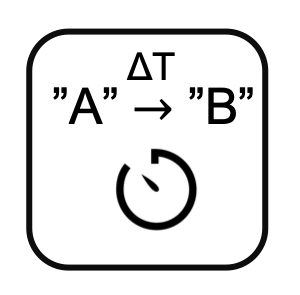

<!--
  ~ Licensed to the Apache Software Foundation (ASF) under one or more
  ~ contributor license agreements.  See the NOTICE file distributed with
  ~ this work for additional information regarding copyright ownership.
  ~ The ASF licenses this file to You under the Apache License, Version 2.0
  ~ (the "License"); you may not use this file except in compliance with
  ~ the License.  You may obtain a copy of the License at
  ~
  ~    http://www.apache.org/licenses/LICENSE-2.0
  ~
  ~ Unless required by applicable law or agreed to in writing, software
  ~ distributed under the License is distributed on an "AS IS" BASIS,
  ~ WITHOUT WARRANTIES OR CONDITIONS OF ANY KIND, either express or implied.
  ~ See the License for the specific language governing permissions and
  ~ limitations under the License.
  ~
  -->

## Aufgabendauer

<p align="center">
    
</p>

***

## Beschreibung

Der Aufgabendauer-Prozessor berechnet die Zeitdauer zwischen Zustandsänderungen in einem Aufgabenfeld. Er unterstützt:
* Aufgabenstatusverfolgung
* Dauerberechnung
* Mehrere Zeiteinheiten
* Prozessidentifikation
* Zustandsübergangszeitmessung
* Leistungsmessung

Dieser Prozessor ist essentiell für:
* Messen von Aufgabendauern
* Verfolgen von Prozesszeiten
* Analysieren von Zustandsübergängen
* Überwachen der Leistung
* Erstellen von Metriken
* Optimieren von Arbeitsabläufen

***

## Erforderliche Eingabe

Der Prozessor benötigt einen Datenstrom, der enthält:
* Ein Aufgabenfeld, das sich ändert, um verschiedene Zustände anzuzeigen
* Ein Zeitstempelfeld für die Dauerberechnung

***

## Konfiguration

### Aufgabenfeld
Wähle das Feld aus, das den Aufgabenstatus enthält. Der Prozessor berechnet die Dauer zwischen Änderungen in diesem Feld.

### Zeitstempelfeld
Wähle das Feld aus, das den Zeitstempel für die Dauerberechnung enthält.

### Ausgabeeinheit
Wähle die Zeiteinheit für die Dauerausgabe:
* Millisekunden (Standard)
* Sekunden
* Minuten

## Ausgabe

Der Prozessor erstellt eine neue Nachricht, die enthält:
* Ein processId-Feld, das den Zustandsübergang anzeigt (Format: "vorherigerZustand-neuerZustand")
* Ein duration-Feld, das die Zeit zwischen Zustandsänderungen in der gewählten Einheit anzeigt

### Beispiel

#### Eingabe-Nachricht
```json
{
  "deviceId": "machine01",
  "timestamp": 1586380104915,
  "taskState": "running"
}
```

#### Konfiguration
* Aufgabenfeld: taskState
* Zeitstempelfeld: timestamp
* Ausgabeeinheit: Sekunden

#### Ausgabe-Nachricht (wenn sich taskState von "running" zu "completed" ändert)
```json
{
  "processId": "running-completed",
  "duration": 120.5
}
```

## Anwendungsfälle

1. **Prozesszeitmessung**
   * Messen von Aufgabendauern
   * Verfolgen von Zustandsübergängen
   * Analysieren von Prozesszeiten
   * Überwachen der Leistung
   * Erstellen von Metriken

2. **Arbeitsablaufanalyse**
   * Messen von Schrittdauern
   * Verfolgen von Übergängen
   * Analysieren von Arbeitsabläufen
   * Überwachen der Effizienz
   * Erstellen von Analysen

3. **Leistungsüberwachung**
   * Messen von Zustandsdauern
   * Verfolgen von Änderungen
   * Analysieren von Zeiten
   * Überwachen der Effizienz
   * Erstellen von Berichten

4. **Qualitätskontrolle**
   * Messen von Zykluszeiten
   * Verfolgen von Zuständen
   * Analysieren von Dauern
   * Überwachen der Qualität
   * Erstellen von Kontrollen

## Hinweise

* Aufgabenfeld muss sich ändern, um eine Ausgabe auszulösen
* Dauer wird zwischen Zustandsänderungen berechnet
* Mehrere Zeiteinheiten werden unterstützt
* Verarbeitung ist zustandsbehaftet
* ProcessId zeigt den Zustandsübergang
* Zeiteinheit sorgfältig wählen
* Keine Verzögerung bei der Verarbeitung
* Ursprüngliche Werte werden nicht beibehalten
* Ausgabe nur bei Zustandsänderung
* Dauer ist immer positiv 