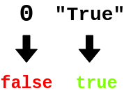

<!--
  ~ Licensed to the Apache Software Foundation (ASF) under one or more
  ~ contributor license agreements.  See the NOTICE file distributed with
  ~ this work for additional information regarding copyright ownership.
  ~ The ASF licenses this file to You under the Apache License, Version 2.0
  ~ (the "License"); you may not use this file except in compliance with
  ~ the License.  You may obtain a copy of the License at
  ~
  ~    http://www.apache.org/licenses/LICENSE-2.0
  ~
  ~ Unless required by applicable law or agreed to in writing, software
  ~ distributed under the License is distributed on an "AS IS" BASIS,
  ~ WITHOUT WARRANTIES OR CONDITIONS OF ANY KIND, either express or implied.
  ~ See the License for the specific language governing permissions and
  ~ limitations under the License.
  ~
  -->

## In Boolean umwandeln

<p align="center">
    
</p>

***

## Beschreibung

Der In-Boolean-umwandeln-Prozessor konvertiert String- oder Zahlenfelder in Boolean-Werte. Er unterstützt:
* String-zu-Boolean-Konvertierung
* Zahl-zu-Boolean-Konvertierung
* Mehrfachfeldtransformation
* Direkte Wertmodifikation

Dieser Prozessor ist essentiell für:
* Konvertieren von Datentypen
* Erstellen von Boolean-Flags
* Transformieren von Werten
* Standardisieren von Daten

***

## Erforderliche Eingabe

Der Prozessor benötigt einen Datenstrom, der mindestens ein String- oder Zahlenfeld enthält, das in einen Boolean umgewandelt werden soll.

***

## Konfiguration

### Umzuwandelnde Felder

Wähle ein oder mehrere String- oder Zahlenfelder aus, die in Boolean-Werte umgewandelt werden sollen. Die Transformationsregeln sind:
* Strings: "true" oder "1" wird zu true, "false" oder "0" wird zu false
* Zahlen: 1 oder 1.0 wird zu true, 0 oder 0.0 wird zu false

## Ausgabe

Der Prozessor erstellt eine neue Nachricht, die enthält:
* Alle ursprünglichen Felder aus der Eingabe-Nachricht
* Die ausgewählten Felder mit ihren Werten in Boolean umgewandelt

### Beispiel

#### Eingabe-Nachricht
```json
{
  "deviceId": "sensor01",
  "status": "true",
  "value": 1,
  "timestamp": 1586380104915
}
```

#### Konfiguration
* Umzuwandelnde Felder: status, value

#### Ausgabe-Nachricht
```json
{
  "deviceId": "sensor01",
  "status": true,
  "value": true,
  "timestamp": 1586380104915
}
```

## Anwendungsfälle

1. **Datenstandardisierung**
   * Konvertieren von String-Zuständen
   * Transformieren von numerischen Flags
   * Standardisieren von Werten
   * Erstellen von Boolean-Flags

2. **Bedingungserstellung**
   * Erstellen von Boolean-Bedingungen
   * Transformieren von Schwellenwerten
   * Konvertieren von Zuständen
   * Erstellen von Flags

## Hinweise

* Nur String- und Zahlenfelder können umgewandelt werden
* String-Vergleich ist case-insensitive
* Zahlen verwenden 1/0-Logik
* Verarbeitung ist zustandslos
* Mehrere Felder können umgewandelt werden 